# [Mac OS/M1] UTM에 Windows 11 가상머신 설치하기

## 사용 환경

- **칩**: MacBook M1 Pro  
- **macOS 버전**: macOS Sonoma 14.6.1  
- **UTM 버전**: 4.6.5  
- **Windows 빌드**: Windows 11 (multi-edition for ARM64)

## 대표적인 설치 방식 2가지: VHDX vs ISO

| 항목   | ISO 파일                        | VHDX 파일                             |
|--------|----------------------------------|----------------------------------------|
| 용도   | 설치용 디스크 이미지            | 가상 하드디스크 이미지                |
| 설명   | 운영체제를 설치하거나 부팅할 때 사용 | 윈도우가 설치된 상태로 바로 실행 가능 |
| 비유   | 윈도우 설치 CD                  | 윈도우가 이미 설치된 가상 컴퓨터     |

## ISO 방식 설치

> [VHDX 설치 방식](https://github.com/kyra0126/windows-arm-utm-vhdx/blob/ce9e6197affd7cd4b0862b5623b173b3a6191e78/README.md)

### 설치 요약

1. Windows 11 ARM64 ISO 파일 다운로드  
2. UTM 설치
3. 새 Window VM 생성  
4. VM 실행 후 인터넷 연결  
5. 언어/지역 변경  

### 설치 방법

#### 1. [Windows 11 ARM64 ISO 파일 다운로드](https://www.microsoft.com/en-us/software-download/windows11arm64)
  Windows 11 (multi-edition for ARM64) 선택 후 다운로드 
  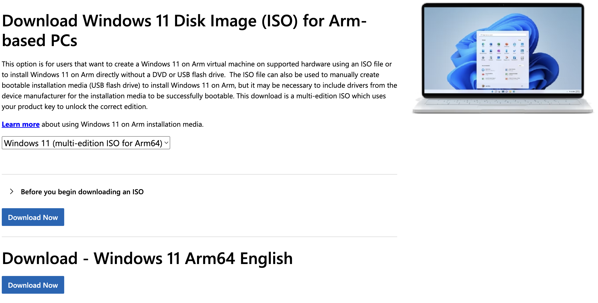

#### 2. [UTM 설치](https://mac.getutm.app)

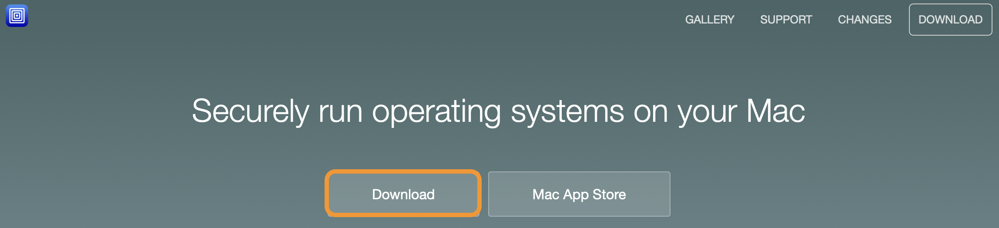

#### 3. 새 Window VM 생성

- Boot ISO Image에 1.에서 다운받은 파일 첨부  
  

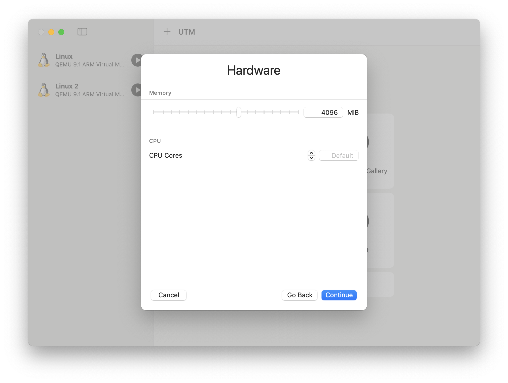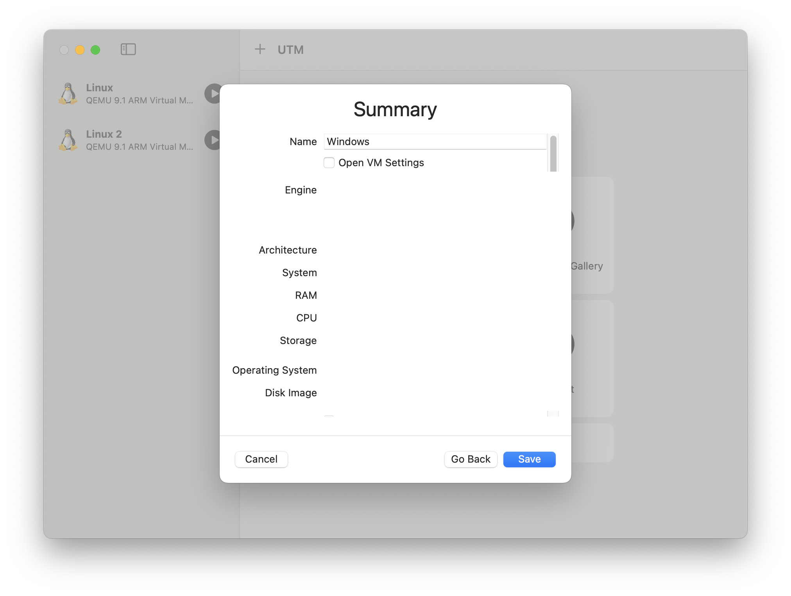

#### 4. VM 실행 후 인터넷 연결

- 아무 키나 눌러 윈도우 설치 시작하기 
- 언어 / 키보드 선택

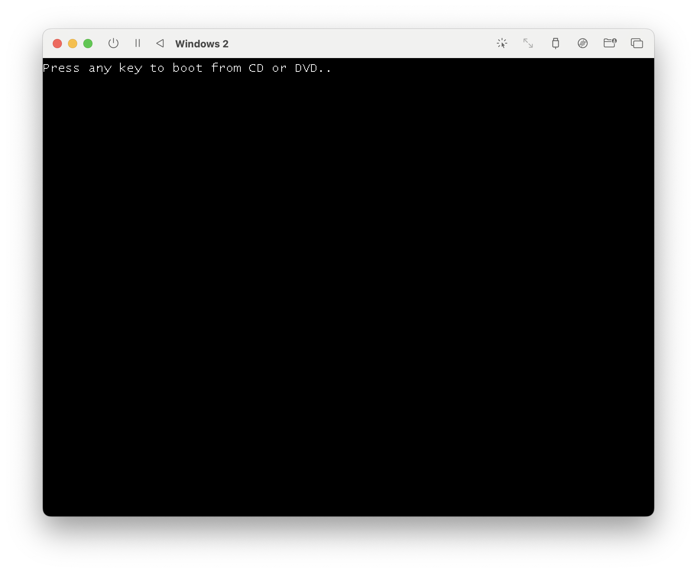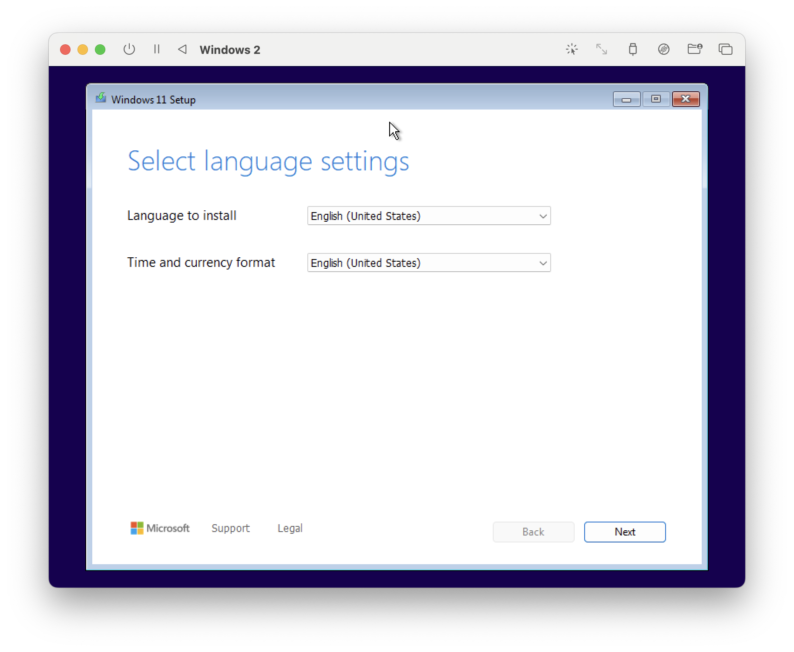

- Image 선택
- I don't have a product key 선택

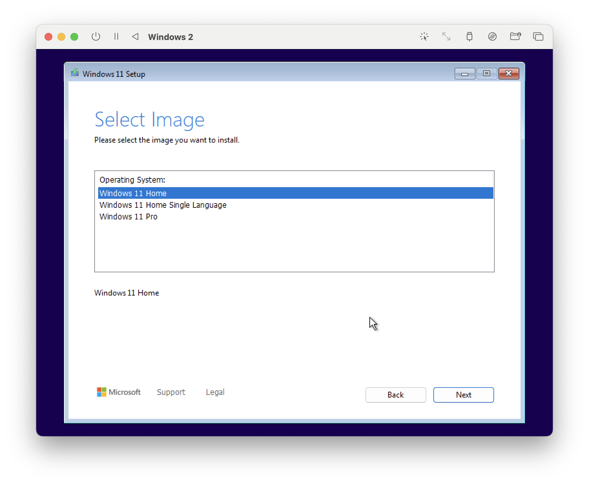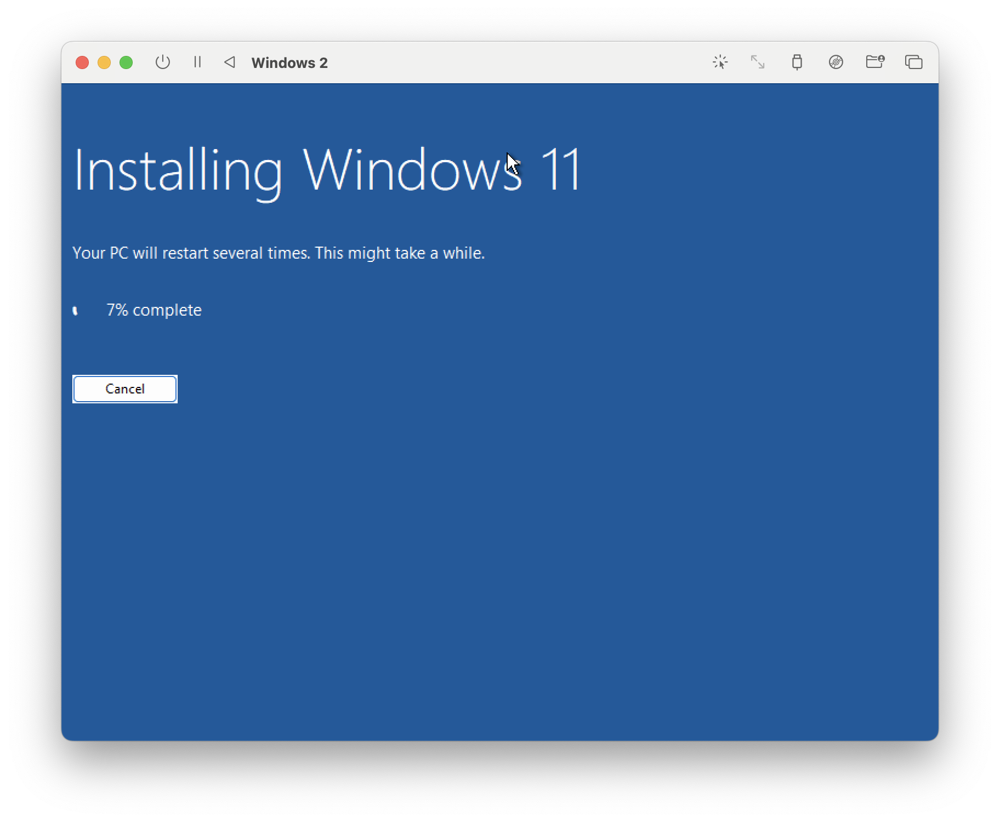

- Windows 설치 완료 후, 자동으로 **utm-guest-tools** 설치 화면 뜸
- 안 뜰 경우, D드라이브 열어 **utm-guest-tools** 설치
- 인터넷 연결 확인 (재부팅)

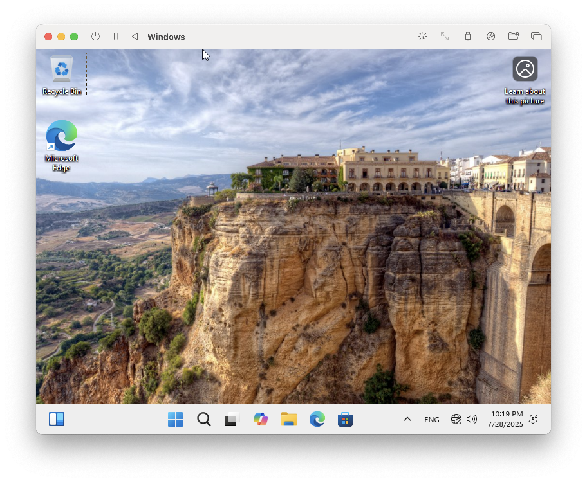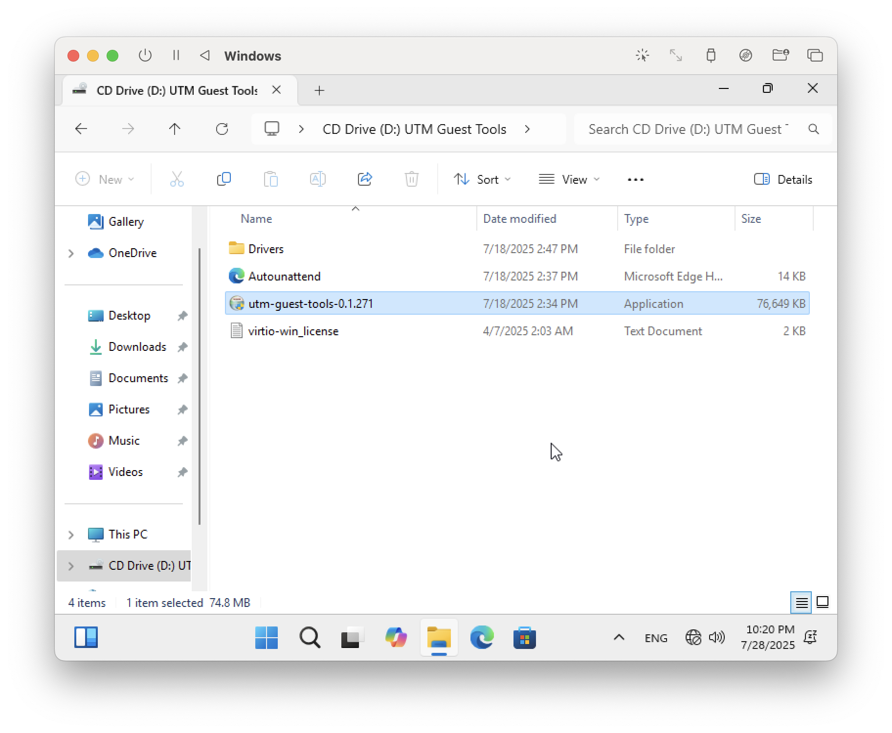

#### 5. 지역/언어 변경

- Settings > Time & Language > Region: Korea

- Add a language > 한국어 > Set as my Windows display language 선택  
- Command + Space키 눌러 한/영 자판 전환

## 트러블 슈팅

### VM 실행 후, OS 부팅 실패

#### 현상
- 부팅 시 "UEFI Interactive Shell v2.2" 화면에서 멈춤
- `Shell>` 프롬프트에서 멈춤
- `startup.nsh` 실행 실패
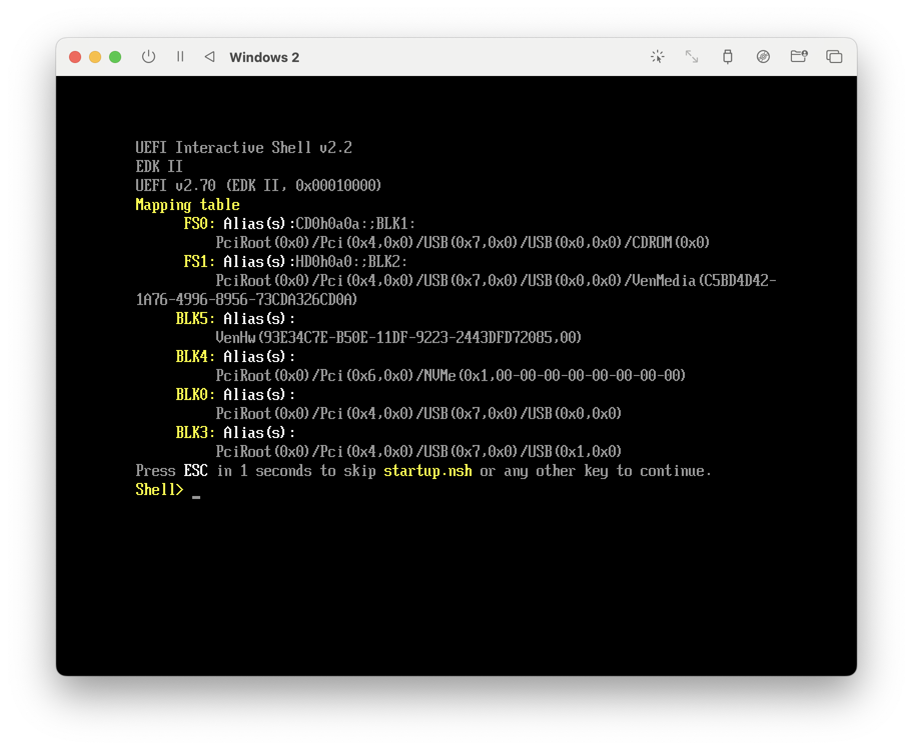

#### 원인
- 잘못된 ISO 파일 다운로드 (Windows 11 for x64 devices: x64(인텔/AMD) 아키텍처용)
- 설치 중간에 재부팅 후 ISO 연결이 끊겨 부팅 실패

#### 해결 방법
보통 검색창에서 ISO 파일 다운로드를 검색하면, [Windows 11 x64 ISO 파일 다운로드](https://www.microsoft.com/en-us/software-download/windows11arm64)로 연결됨
Apple Silicon 칩은 ARM64를 다운받아야하므로, 해당 파일 말고 **here**를 눌러 ARM64 다운로드 링크로 이동

ARM64 파일이 맞는 지 확인 후, 다운로드

재부팅 후, 아래 화면에서 아무 키나 빠르게 입력

만약, 재부팅 후에도 계속해서 같은 에러가 발생할 경우, VHDX 방식으로 전환
> [VHDX 설치 방식](https://github.com/kyra0126/windows-arm-utm-vhdx/blob/ce9e6197affd7cd4b0862b5623b173b3a6191e78/README.md)
